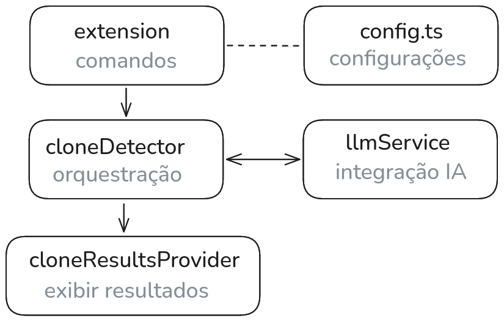

# Code Clone Detector

Extensão para VS Code que detecta clones de código no workspace utilizando Modelos de Linguagem de Grande Escala (LLMs). Desenvolvida como Trabalho de Conclusão de Curso (TCC) de Engenharia de Software na Uninter.

## Como Funciona

1. Selecione um trecho de código no editor
2. Clique com o botão direito e escolha **CCD: Find Code Clones**
3. Selecione quais arquivos do workspace deseja analisar
4. Os resultados aparecem na barra lateral — clique em qualquer resultado para ir direto ao clone

## Provedores de LLM Suportados

| Provedor               | Modo            |
|------------------------|-----------------|
| **Ollama**             | Local (offline) |
| **OpenAI**             | Online          |
| **Claude** (Anthropic) | Online          |
| **Gemini** (Google)    | Online          |
| **OpenCode**           | Online          |

O Ollama roda inteiramente na sua máquina — nenhum dado sai do seu computador. Requer Ollama previamente instalado e com o modelo baixado e rodando.

## Extensões Suportadas

`.ts` `.tsx` `.js` `.jsx` `.py` `.java` `.c` `.cpp` `.cs` `.go` `.rs` `.rb` `.kt` `.kts` `.swift` `.php` `.scala` `.r` `.lua` `.pl` `.sql` `.sh` `.zig` `.pas`

## Instalação

### A partir do código-fonte

```bash
git clone https://github.com/maico-smaniotto/code-clone-detector.git
cd code-clone-detector
npm install
npm run package
```

Em seguida, carregue a extensão no VS Code:
1. Pressione `Ctrl+Shift+P` → **Extensions: Install from VSIX...**
2. Selecione `dist/code-clone-detector.vsix`

## Configuração

Abra as **Configurações** (`Ctrl+,`) e pesquise por `Code Clone Detector`, ou adicione ao seu `settings.json`:

```json
{
  "codeCloneDetector.llmProvider": "ollama",
  "codeCloneDetector.modelName": "llama3",
  "codeCloneDetector.ollamaEndpoint": "http://127.0.0.1:11434",
  "codeCloneDetector.apiKey": "",
  "codeCloneDetector.detectPrompt": "You are a code clone detector. Find snippets in the given Target Source Code that are semantically identical or very similar to the Query Snippet. Return exclusively in format: File: <filename>, Method: <methodname>, Lines: <start>-<end>. If none, say None."
}
```

### Opções

| Configuração       | Descrição                                 | Padrão                                         |
|--------------------|-------------------------------------------|------------------------------------------------|
| `llmProvider`      | Provedor de LLM a utilizar                | `ollama`                                       |
| `apiKey`           | Chave de API para provedores online       | `""`                                           |
| `modelName`        | Identificador do modelo                   | `llama3`                                       |
| `ollamaEndpoint`   | Endpoint local do Ollama                  | `http://127.0.0.1:11434`                       |
| `opencodeEndpoint` | Endpoint da API OpenCode                  | `https://api.opencode.com/v1/chat/completions` |
| `detectPrompt`     | Prompt do sistema para detecção de clones | *(ver acima)*                                  |

## Comandos

| Comando | Descrição |
|---------|-----------|
| `CCD: Find Code Clones` | Inicia a análise de clones no código selecionado |
| `CCD: Open Clone` | Abre o arquivo e destaca o clone detectado |

## Arquitetura



## Stack Tecnológica

- **TypeScript**
- **VS Code Extension API**
- **Webpack** (empacotamento)
- **Axios** (requisições HTTP)
- **Mocha** (testes)

## Licença

MIT

---

# English

VS Code extension that detects code clones across the workspace using Large Language Models (LLMs). Developed as a final year project (TCC) in Software Engineering at Uninter.

## How It Works

1. Select a code snippet in the editor
2. Right-click and choose **CCD: Find Code Clones**
3. Select which workspace files to analyze
4. Results appear in the sidebar — click any result to jump directly to the clone location

## Supported LLM Providers

| Provider               | Mode            |
|------------------------|-----------------|
| **Ollama**             | Local (offline) |
| **OpenAI**             | Online          |
| **Claude** (Anthropic) | Online          |
| **Gemini** (Google)    | Online          |
| **OpenCode**           | Online          |

Ollama runs entirely on your machine — no data leaves your computer. Requires Ollama previously installed and the model configured and running.

## Supported Extensions

`.ts` `.tsx` `.js` `.jsx` `.py` `.java` `.c` `.cpp` `.cs` `.go` `.rs` `.rb` `.kt` `.kts` `.swift` `.php` `.scala` `.r` `.lua` `.pl` `.sql` `.sh` `.zig` `.pas`

## Installation

### From source

```bash
git clone https://github.com/maico-smaniotto/code-clone-detector.git
cd code-clone-detector
npm install
npm run package
```

Then load the extension in VS Code:
1. Press `Ctrl+Shift+P` → **Extensions: Install from VSIX...**
2. Select `dist/code-clone-detector.vsix`

## Configuration

Open **Settings** (`Ctrl+,`) and search for `Code Clone Detector`, or add to your `settings.json`:

```json
{
  "codeCloneDetector.llmProvider": "ollama",
  "codeCloneDetector.modelName": "llama3",
  "codeCloneDetector.ollamaEndpoint": "http://127.0.0.1:11434",
  "codeCloneDetector.apiKey": "",
  "codeCloneDetector.detectPrompt": "You are a code clone detector. Find snippets in the given Target Source Code that are semantically identical or very similar to the Query Snippet. Return exclusively in format: File: <filename>, Method: <methodname>, Lines: <start>-<end>. If none, say None."
}
```

### Options

| Setting | Description | Default |
|---------|-------------|---------|
| `llmProvider` | LLM provider to use | `ollama` |
| `apiKey` | API key for online providers | `""` |
| `modelName` | Model identifier | `llama3` |
| `ollamaEndpoint` | Ollama local endpoint | `http://127.0.0.1:11434` |
| `opencodeEndpoint` | OpenCode API endpoint | `https://api.opencode.com/v1/chat/completions` |
| `detectPrompt` | System prompt for clone detection | *(see above)* |

## Commands

| Command | Description |
|---------|-------------|
| `CCD: Find Code Clones` | Trigger clone analysis on selected code |
| `CCD: Open Clone` | Open file and highlight the detected clone |

## Architecture

```

```

## Tech Stack

- **TypeScript**
- **VS Code Extension API**
- **Webpack** (bundling)
- **Axios** (HTTP requests)
- **Mocha** (testing)

## License

MIT
